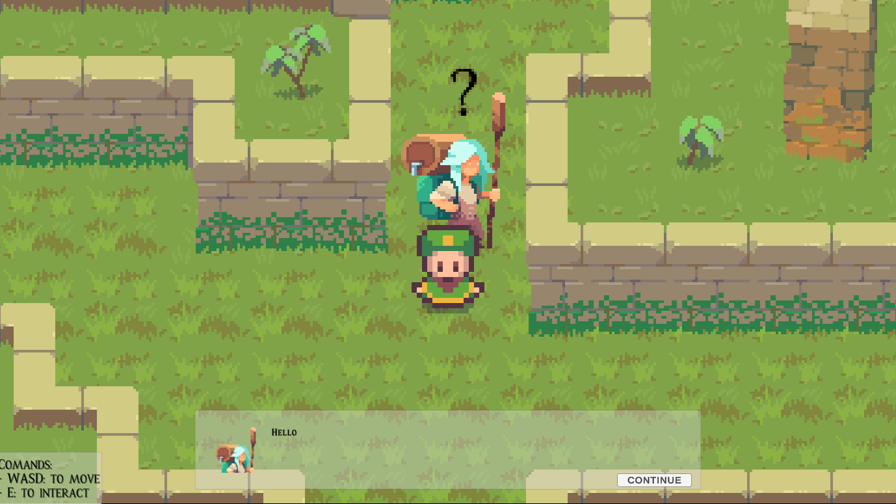

# Educational-Game-Room

Progetto di tirocinio per il corso di Informatica.

## Obiettivo

Progetto in ambito di Computer Science Education, con l'obbiettivo di proporre un "laboratorio" innvativo e più stimolante per l'apprendimento delle tecnologie di programmazione, attraverso giochi interattivi e programmazione a blocchi in un ambiente virtuale.

## 3D World

Questo progetto è una versione di un ambiente virtuale 3D, nel quale si potrà interagire con dei cabinati per giocare e programmare attraverso un'interfaccia a blocchi.

## Giochi

### Albion

**Genere: Metroidvania**

Il MetroidVania è un sottogenere dei videogiochi di azione-avventura. Il termine è composto dai nomi delle serie Metroid e Castlevania dalle quali il sottogenere è nato. I videogiochi MetroidVania usano game design e meccaniche simili ai videogiochi di queste due serie.

### Pathfinder Hero's Journey

**Genere: Puzzle Game**

Gioco nel quale sarà necessario risolvere alcuni indovinelli proprosti dagli NPCs (Non Playable Characters) per poter avanzare nel labirinto.

